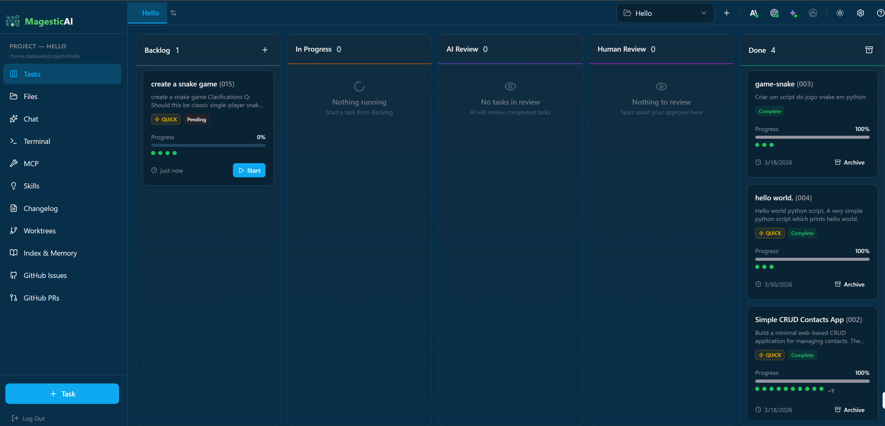
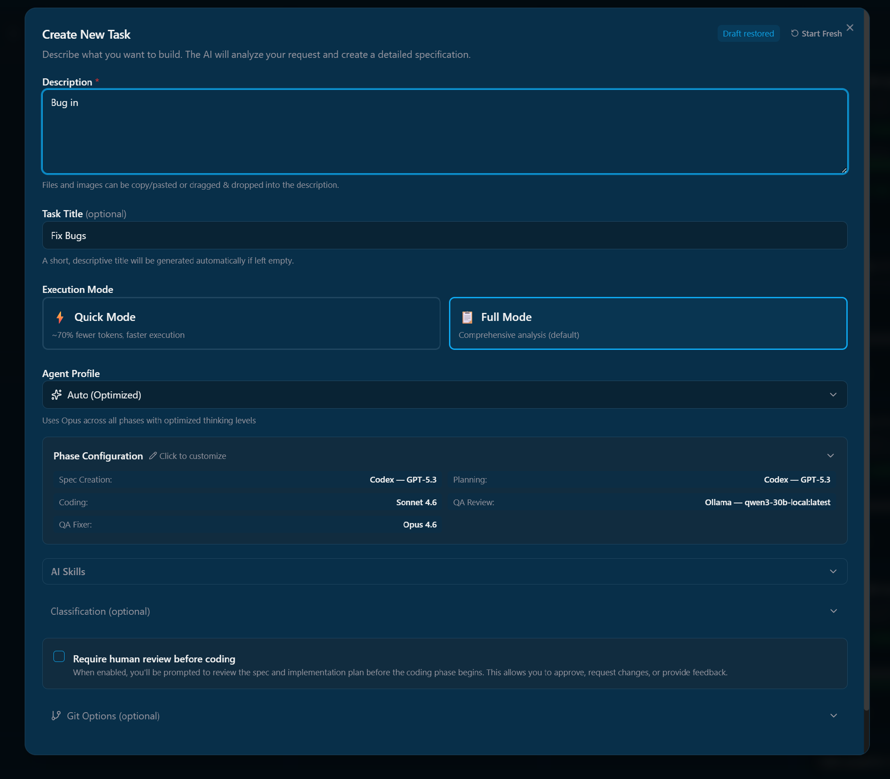
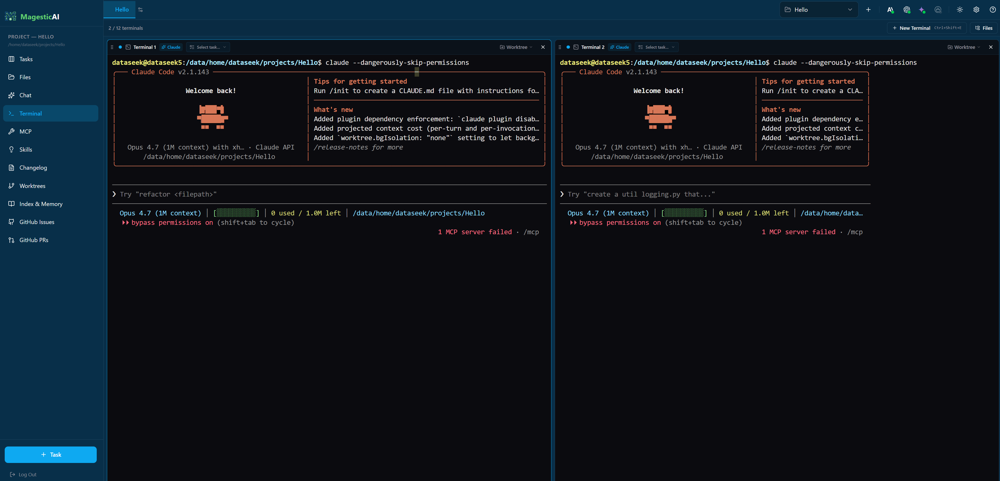
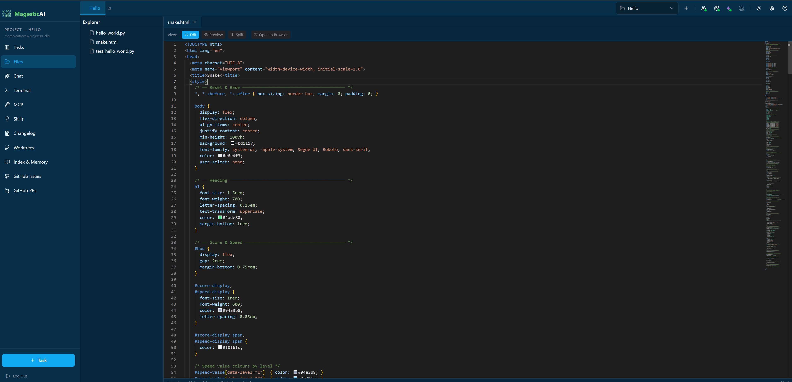
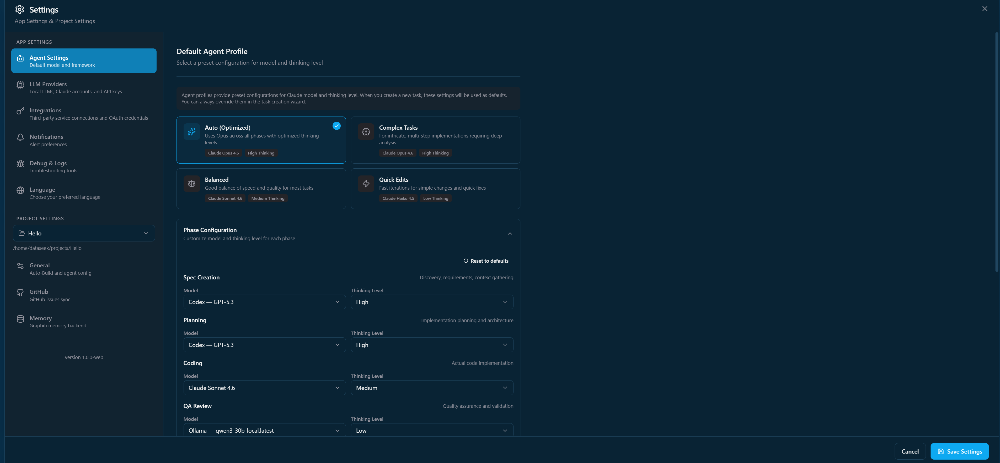

# MagesticAI

**SDD (Spec-Driven Development) — a cloud and web-based AI task management and agent orchestration platform powered by LLMs**

[](https://github.com/dataseeek/MagesticAI/actions/workflows/ci.yml)
[](https://www.gnu.org/licenses/agpl-3.0)
[](https://nodejs.org/)
[](https://www.python.org/)
[](https://react.dev/)
[](https://fastapi.tiangolo.com/)

---

## Overview

MagesticAI is a browser-based platform for managing AI-powered coding tasks through coordinated autonomous agents. It provides a modern web interface for task creation, execution monitoring, terminal access, and code review - all accessible from any browser.

### Key Features

- **Kanban Task Board** - Visual task management with drag-and-drop
- **Multi-Agent Orchestration** - Planner, Coder, and QA agents work together
- **Real-time Terminal** - Full PTY terminal access in browser
- **Monaco Code Editor** - VS Code-like editing experience
- **Git Worktree Isolation** - Safe, isolated builds per task
- **AI-Powered QA** - Automated code review and validation
- **Local LLM Agentic Mode** - Ollama models with native tool calling (Read, Write, Edit, Bash, Glob, Grep) — no API fallback needed
- **Multi-Provider Support** - Claude, Codex, Gemini, and Ollama with automatic agentic/text-only routing per phase
- **Graphiti Memory** - Cross-session learning and knowledge retention
- **Multi-Project Support** - Manage multiple repositories
- **Internationalization** - English, French, Portuguese (Brazil)

---

## Demo Video

[](https://youtu.be/L0DEeaLuxYA)

_A quick walkthrough of the Kanban board, task creation flow, and agent execution._

---

## Screenshots

| View | Preview |
|------|---------|
| Kanban task board       |  |
| Task creation wizard    |  |
| Built-in PTY terminal   |  |
| Monaco code editor      |  |
| Settings & onboarding   |  |

---

## Supported Platforms

| OS / Runtime | Status | Notes |
|---|---|---|
| **Ubuntu 24.04 LTS** (kernel 6.8) | ✅ Tested | Primary development environment. Docker 27.x. |
| Other recent Linux distros | ✅ Should work | Same dependencies (Python 3.12+, Node 24+, optionally Docker). |
| **macOS** (Intel + Apple Silicon) | ⚠️ Should work, untested | Native install of the backend + frontend is straightforward. The Docker `macvlan` networking in `docker-compose.yml` is **Linux-only** — on macOS run the stack natively, or replace the macvlan network with a bridge + port mapping. |
| **Windows (WSL2)** | ⚠️ Should work, untested | Run inside an Ubuntu WSL2 distro and treat it as Linux. Native Windows is not supported. |
| **Windows (native)** | ❌ Not supported | Some scripts assume bash, Linux tools, and a POSIX filesystem. |

> If you successfully run MagesticAI on a platform marked untested, open a PR adding your config to this table — happy to mark it ✅.

---

## Quick Start

### Prerequisites

- **Node.js 24+** and npm 10+
- **Python 3.12+**
- **Git**
- **Claude Code OAuth Token** (run `claude setup-token`)

### Installation

```bash
# 1. Clone the repository
git clone https://github.com/dataseeek/MagesticAI.git
cd MagesticAI

# 2. Install all dependencies
npm run install:all

# 3. Configure environment
cp apps/backend/.env.example apps/backend/.env
cp apps/web-server/.env.example apps/web-server/.env
# Edit .env files with your CLAUDE_CODE_OAUTH_TOKEN
```

### Running the Application

**Terminal 1 - Backend Server:**
```bash
cd apps/web-server
source .venv/bin/activate
python -m server.main
# Server runs on http://localhost:3101
# API token printed to console and saved to ~/.magestic-ai/.token
```

**Terminal 2 - Frontend Dev Server:**
```bash
cd apps/frontend-web
npm run dev
# UI available at http://localhost:3100
```

### Docker Deployment

MagesticAI includes a `Dockerfile` and `docker-compose.yml` for containerized deployment:

```bash
# Build and start (clean)
docker compose down -v && docker compose build && docker compose up -d

# Start without rebuilding
docker compose up -d

# Retrieve the auto-generated API token
docker exec magesticai cat /home/magesticai/.magestic-ai/.token
```

Access the web UI at `http://YOUR_HOST:3101` after the container starts.

See [ContainerAPP.md](ContainerAPP.md) for detailed Docker deployment instructions.

---

## Architecture

```
┌─────────────────────────────────────────────────────────────────┐
│                   MagesticAI                        │
├─────────────────────────────────────────────────────────────────┤
│                                                                  │
│   Browser (React 19 + Vite)           Port 3100                 │
│   ├── Kanban Board                                               │
│   ├── Terminal Grid (xterm.js)                                   │
│   ├── Code Editor (Monaco)                                       │
│   ├── Task Detail Modal                                          │
│   └── Real-time WebSocket Updates                                │
│                                                                  │
├─────────────────────────────────────────────────────────────────┤
│                                                                  │
│   Web Server (FastAPI)                Port 3101                 │
│   ├── REST API (/api/*)                                          │
│   ├── WebSocket Endpoints (/ws/*)                                │
│   ├── PTY Session Management                                     │
│   ├── Agent Execution Service                                    │
│   └── File Operations                                            │
│                                                                  │
├─────────────────────────────────────────────────────────────────┤
│                                                                  │
│   Backend Agents (Python)                                        │
│   ├── Claude Agent SDK Integration                               │
│   ├── Multi-Provider Engine (Claude/Codex/Gemini/Ollama)         │
│   ├── Local LLM Tool Calling (Read/Write/Edit/Bash/Glob/Grep)   │
│   ├── Planner Agent (creates implementation plans)               │
│   ├── Coder Agent (implements subtasks)                          │
│   ├── QA Reviewer (validates code)                               │
│   ├── QA Fixer (resolves issues)                                 │
│   └── Graphiti Memory (LadybugDB)                                │
│                                                                  │
└─────────────────────────────────────────────────────────────────┘
```

---

## Tech Stack

### Frontend (`apps/frontend-web/`)

| Technology | Version | Purpose |
|------------|---------|---------|
| React | 19.2.3 | UI Framework |
| TypeScript | 5.9.3 | Type Safety |
| Vite | 7.2.7 | Build Tool |
| Tailwind CSS | 4.1.17 | Styling |
| Zustand | 5.0.9 | State Management |
| Radix UI | Latest | Accessible Components |
| xterm.js | 6.0.0 | Terminal Emulation |
| Monaco Editor | 4.6.0 | Code Editor |
| i18next | 25.7.3 | Internationalization |
| @dnd-kit | Latest | Drag and Drop |

### Backend Web Server (`apps/web-server/`)

| Technology | Version | Purpose |
|------------|---------|---------|
| FastAPI | Latest | REST API Framework |
| Uvicorn | Latest | ASGI Server |
| Pydantic | v2 | Data Validation |
| ptyprocess | Latest | Terminal Management |
| websockets | Latest | Real-time Communication |
| GitPython | Latest | Git Operations |

### Backend Agents (`apps/backend/`)

| Technology | Version | Purpose |
|------------|---------|---------|
| Python | 3.12+ | Runtime |
| Claude Agent SDK | Latest | AI Agent Framework |
| Ollama | Local | Local LLM with native tool calling |
| Graphiti | Latest | Knowledge Graph Memory |
| LadybugDB | Embedded | Graph Database (no Docker) |

---

## Project Structure

```
MagesticAI/
├── apps/
│   ├── frontend-web/        # React web frontend (Vite)
│   │   ├── src/
│   │   │   ├── components/  # 57+ React components
│   │   │   ├── stores/      # 14 Zustand stores
│   │   │   ├── hooks/       # Custom React hooks
│   │   │   ├── lib/         # API client, WebSocket
│   │   │   └── shared/      # Types, i18n, constants
│   │   └── package.json
│   │
│   ├── web-server/          # FastAPI backend
│   │   └── server/
│   │       ├── routes/      # REST API endpoints
│   │       ├── websockets/  # WebSocket handlers
│   │       ├── services/    # Agent execution service
│   │       └── pty/         # Terminal management
│   │
│   ├── backend/             # Python agent system
│   │   ├── agents/          # Planner, Coder agents
│   │   ├── providers/       # Multi-LLM adapters (Claude, Codex, Gemini, Ollama)
│   │   ├── tools/           # Reusable tool executor (Read, Write, Edit, Bash, Glob, Grep)
│   │   ├── qa/              # QA Reviewer, Fixer
│   │   ├── spec/            # Spec creation pipeline
│   │   ├── security/        # Command validation & path boundary
│   │   ├── integrations/    # Graphiti, Linear, GitHub
│   │   └── prompts/         # Agent system prompts
│   │
├── guides/                  # Extended documentation
├── tests/                   # Test suite
├── scripts/                 # Build scripts
├── Dockerfile               # Container image definition
├── docker-compose.yml       # Container orchestration
├── CHANGELOG.md             # Version history
├── RELEASE.md               # Release process guide
├── AGENTS.md                # AI agent instructions
├── GEMINI.md                # Gemini AI instructions
├── ContainerAPP.md          # Docker deployment guide
└── package.json             # Root package
```

---

## Views & Features

| View | Description |
|------|-------------|
| **Kanban** | Task board with drag-and-drop status management |
| **Terminals** | Multi-terminal grid with PTY support |
| **Editor** | Monaco code editor with file browser |
| **Worktrees** | Git worktree management and merge operations |
| **Roadmap** | AI-generated feature roadmap |
| **Ideation** | AI-powered feature brainstorming |
| **Context** | Project indexing and memory system |
| **GitHub Issues** | GitHub issue integration |
| **GitLab Issues** | GitLab issue integration |
| **GitHub PRs** | Pull request AI review |
| **Changelog** | Automatic changelog generation |
| **Insights** | AI analysis and project insights |
| **MCP Overview** | Agent tools documentation |

---

## Task Lifecycle

```
1. CREATE     →  TaskCreationWizard generates spec
2. PLAN       →  Planner Agent creates subtask plan
3. CODE       →  Coder Agent implements in isolated worktree
4. QA REVIEW  →  QA Agent validates against acceptance criteria
5. FIX        →  QA Fixer resolves any issues (loops back to QA)
6. MERGE      →  Human reviews and merges to main branch
```

---

## Configuration

### Environment Variables

**Backend (`apps/backend/.env`):**
```bash
CLAUDE_CODE_OAUTH_TOKEN=your-oauth-token
GRAPHITI_ENABLED=true
# Optional: LINEAR_API_KEY, GITHUB_TOKEN
```

**Web Server (`apps/web-server/.env`):**
```bash
APP_HOST=0.0.0.0
APP_PORT=3101
APP_DEBUG=true
# APP_API_TOKEN=xxx  # Auto-generated if not set
```

**Frontend (`apps/frontend-web/.env`):**
```bash
VITE_API_BASE_URL=/api
VITE_WS_BASE_URL=ws://localhost:3101
```

---

## API Endpoints

### REST API (`/api/`)

| Endpoint | Method | Description |
|----------|--------|-------------|
| `/api/projects` | GET/POST | List/create projects |
| `/api/projects/{id}` | GET/PUT/DELETE | Project CRUD |
| `/api/tasks` | GET/POST | List/create tasks |
| `/api/tasks/{id}/start` | POST | Start task execution |
| `/api/terminals` | GET/POST | Terminal management |
| `/api/files/list` | GET | Directory listing |
| `/api/files/read` | GET | Read file content |
| `/api/settings` | GET/PUT | App settings |

### WebSocket Endpoints (`/ws/`)

| Endpoint | Purpose |
|----------|---------|
| `/ws/events` | Global event broadcasting |
| `/ws/terminal/{id}` | Terminal I/O |
| `/ws/tasks/{id}/progress` | Task progress streaming |
| `/ws/tasks/{id}/logs` | Task log streaming |

---

## Documentation

- **[CLAUDE.md](CLAUDE.md)** - AI assistant instructions and architecture reference
- **[AGENTS.md](AGENTS.md)** - Agent configuration for AI coding tools
- **[GEMINI.md](GEMINI.md)** - Gemini AI assistant instructions
- **[CHANGELOG.md](CHANGELOG.md)** - Version history and release notes
- **[RELEASE.md](RELEASE.md)** - Release process documentation
- **[ContainerAPP.md](ContainerAPP.md)** - Docker deployment guide
- **[guides/](guides/)** - Extended technical documentation

---

## Scripts

```bash
# Development
npm run dev              # Start web frontend (dev mode)

# Installation
npm run install:all      # Install all dependencies
npm run install:backend  # Backend only
npm run install:frontend # Frontend only

# Testing
npm run test             # Run frontend tests
npm run test:backend     # Run backend tests

# Production
npm run build            # Build frontend for production
```

---

## Troubleshooting

| Issue | Solution |
|-------|----------|
| Cannot connect to backend | Ensure web-server running on port 3101 |
| Invalid token | Get token from `~/.magestic-ai/.token` |
| WebSocket failed | Check token in URL, verify ports accessible |
| Task stuck | Check agent logs in Settings → Logs |
| Memory errors | Verify `GRAPHITI_ENABLED=true` in backend .env |

---

## Contributing

We welcome contributions! To get started:

1. Fork the repository
2. Create a feature branch from `develop`: `git checkout -b fix/my-fix develop`
3. Make your changes and commit with sign-off: `git commit -s -m "fix: description"`
4. Push to your branch: `git push origin fix/my-fix`
5. Create a PR targeting `develop`: `gh pr create --base develop`

See [RELEASE.md](RELEASE.md) for the full release and versioning process.

---

## License

This project is licensed under the **GNU Affero General Public License v3.0 (AGPL-3.0)**.

See [LICENSE](LICENSE) for details.

---

## Credits

MagesticAI is a fork of [Aperant](https://github.com/AndyMik90/Aperant) (formerly *Auto Claude Desktop*) by [@AndyMik90](https://github.com/AndyMik90). We thank the original authors for the foundational work.

---

## Support

- **Issues:** [GitHub Issues](https://github.com/dataseeek/MagesticAI/issues)
- **Discussions:** [GitHub Discussions](https://github.com/dataseeek/MagesticAI/discussions)

---

**Made with AI by DataSeek Team**
